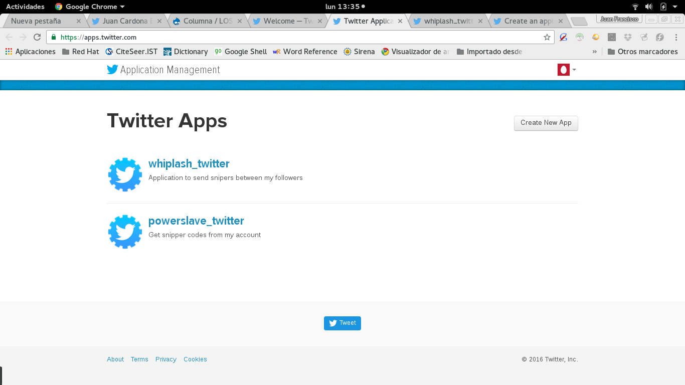
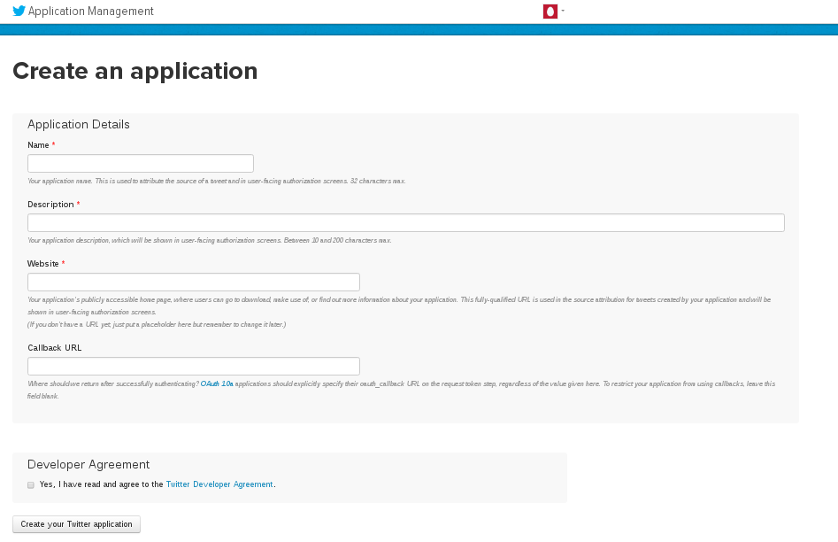
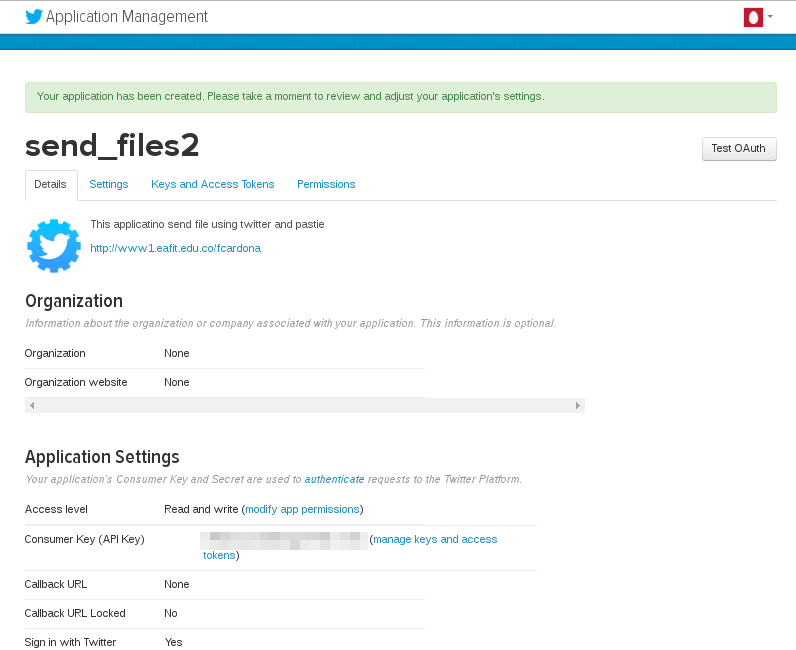
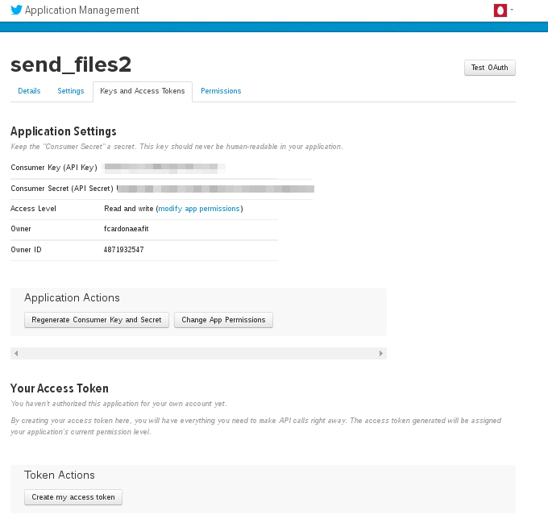
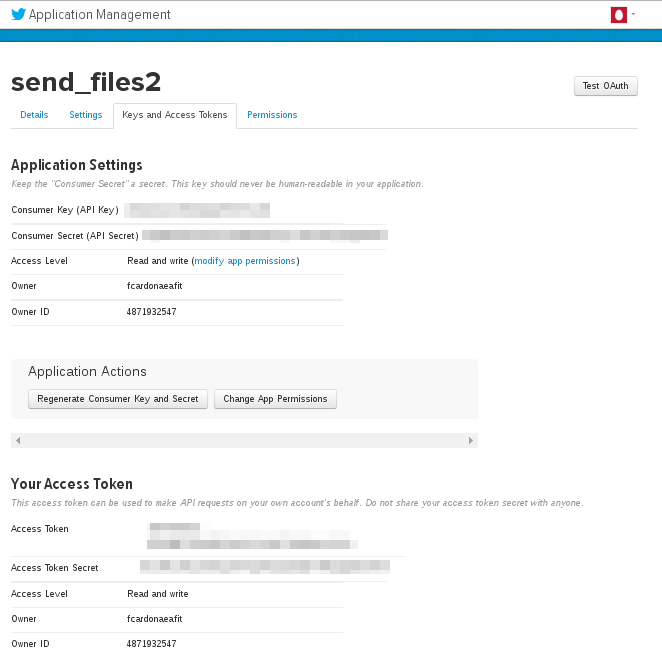

# wpps

Enviar y recibir ejemplos de codigo utilizando twitter y pastie.

## Requerimientos

wpps está desarrollado completamente en Ruby, a través del sistema de
paquetes `ruby gems` y la aplicación depende de las siguientes "gemas":

- twitter 5.16.0
- pastie-api 0.2.1
- faraday 0.9.2
- faraday_middleware 0.10.0
- nokogiri 1.6.8.1

## Instalación Ruby

[1]: Ruby debe ser instalado utilizando las versiones del mismo que permitan construir
código nativo en cada plataforma.

### Linux

En Linux existen muchas distribuiciones. Vamos a mencionar solamente dos de ellas:

#### Linux Ubuntu

En Ubuntu se debe instalar ruby y su versión de desarrollo:

```
$ sudo apt-get install ruby-full
```

#### Linux Fedora

En Fedora se debe instalar ruby y su versión de desarrollo:

```
$ sudo dnf install ruby ruby-devel
```

### OS/X

En OS/X utilizando Homebrew

```
$ brew instal ruby
```

## Instalando wpps

Una vez instalado el ruby con el sistema de gemas. Es necesario instalar `wpps`:

```
$ gem install wpps
```

El anterior comando se encarga de instalar el sistema.

## Creando fichero de permisos en twitter

Si se quiere compartir ficheros con los estudiantes a través de wpps. En primer
lugar, se debe tener una cuenta en twitter.

Una vez creada la cuenta en twitter se abre el url: https://apps.twitter.com.
Como se ve en la siguiente imagen se obtiene la visión de las aplicaciones que
tiene el usuario, actualmente muestra dos. Vamos a crear una aplicaciones, para
ello presionamos el botón `Create New App`.



Una vez presionado el botón obtenemos la siguiente pantalla:



Esta pantalla solicita la información para la aplicación:

* Name. Nombre de la aplicación. Esta es un nombre hasta 32 caracteres se
sugiere nombres en minúsculas, sin espaciones y si lo requiere separar con
guión bajo.
* Description. Descripción de la aplicación. La descripción de la aplicación,
es un texto que describe la aplicación entre 20 y 200 carácteres.
* Website: Sitio web. URL válido de la dirección donde reside la información
de la aplicación.
* Callback URL (opcional). URL de llamada de retorno. El URL que es establecido
para recibir el token de autorización en un página que pueda procesarlo. No es
necesario para la aplicación.

Para poder compartir la aplicación wpps, enviar y recibir código. Debe crear
dos apliaciones: una para el envio (`wp`) y otra para recibir (`wpps`).
Suponga que vamos a definir una apliaciones para enviar ficheros `send_file2`.
Estos serían los campos a llenar:

* Name: `send_file2`
* Description: Application to send source files using twitter and pastie.
* Website: http://www1.eafit.edu.co/fcardona

Una vez creada la aplicación aparece la siguiente página:



Ya la aplicación esta definida dentro de twitter, pero falta establecer los
permisos que la aplicación puede tener. Los permisos se acceden a través de la
pestaña "Permission".

Son tres los tipos de permisos que permite la aplicación:

* Read only,
* Read and write,
* Read, write and Access direct messages.

Para las aplicaciones que enviará ficheros se deben tener los permisos
de Read and write (Lectura y escritura). Para la aplicación que recibe
ficheros, esta debe tener permisos de Read (lectura). Seleccione los permisos
correspondientes para su tipo de aplicación y establescalos. En el caso del
ejemplo de la aplicación `send_file2` los permisos deben ser de lectura y
escritura.

Se debe crear un fichero que contiene los permisos de la aplicación y para ello
debemos obtener las claves y tokens de acceso. Para ello seleccionamos la
pestaña "Key and Access Tokens" (Claves y ficha de acceso).

El fichero contiene cuatro campos:

* consumer_key. Llave del consumidor.
* consumer_secret. Clave secreta del consumidor.
* access_token. Ficha de acceso.
* access_token_secret. Clave secreta de la ficha de acceso.

Los campos son obtenidos de la página "Key and Access Tokens". En la
siguiente figura se ve la página.



En este momento se observa la información de los dos primeros campos. Para
obtener los dos siguientes (access_token y access_token_secret) se presiona
el botón que se encuentra en la parte inferior de la página
`Create my access token`.

Al presionar el botón ya se obtiene la información de los cuatro campos,
como se ve en la siguiente figura.



Ya se puede crear un fichero que contenga las entradas, este
fichero debe ser compartido con los usuarios que se encarga de
enviar y recibir.

```
consumer_key: <valor en la página>
consumer_secret: <valor en la página>
access_token: <valor en la página>
access_token_secret: <valor en la página>
```

## Instalación de `wpps`

Un vez instalado ruby [Ver][1]
 Copyright (c)  Copyright Holder All Rights Reserved.
